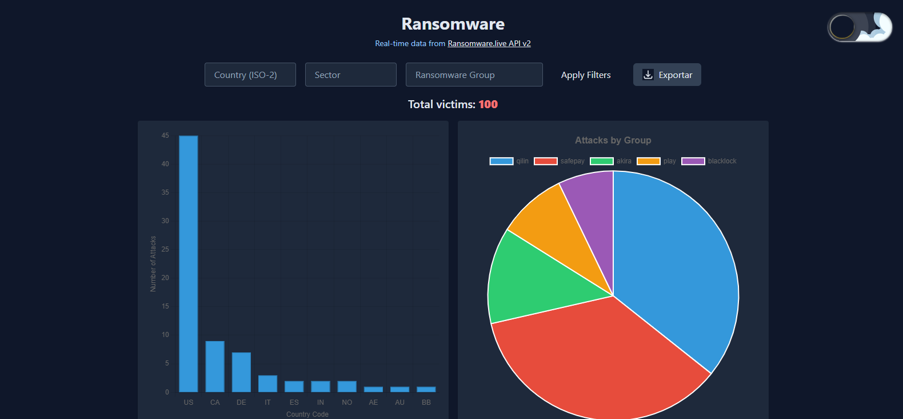

# 🛡️ Ransomware Dashboard

**Intel Tool for Real-Time Threat Visualization**  
Desarrollado como parte del proceso de selección para el rol de Software Developer en el Growth Team de **Lumu Technologies**.

## 🎯 Objetivo

Este dashboard fue diseñado para ayudar a analistas y cazadores de amenazas a detectar patrones de ataques de ransomware en tiempo real utilizando la API pública [ransomware.live](https://www.ransomware.live/api).  
Ofrece visualizaciones interactivas, filtros dinámicos y estadísticas clave para facilitar la toma de decisiones rápidas.

---

## 🧰 Tecnologías Usadas

- **Backend**: Python + Flask  
- **Frontend**: HTML + CSS + JavaScript (vanilla)  
- **Librerías JS**: Chart.js  
- **API externa**: [https://api.ransomware.live/v2](https://api.ransomware.live/v2)

---

## 🖥️ Funcionalidades

- 🔍 **Filtrado dinámico** por país, grupo y sector.  
- 📊 **Gráficas** interactivas de víctimas por grupo, país y línea de tiempo.  
- 📁 **Exportación** de datos filtrados en formato JSON.  
- 🌙 **Modo oscuro** para una experiencia más cómoda.  
- 🧠 Manejo eficiente de estructuras anidadas con **recursividad**.

---

## 🧪 Ejecución local

### 1. Clona el repositorio

```bash
git clone https://github.com/estefaniarizzo/ransomware.git
cd ransomware-dashboard
```
### 2. Crear un entorno local
```bash
python -m venv venv
source venv/bin/activate  # en Linux/macOS
venv\Scripts\activate     # en Windows
```
### 3. Instala dependencias
```bash

pip install -r requirements.txt
```
### 4. Ejecuta el servidor
```bash

python app.py
```
El dashboard estará disponible en http://127.0.0.1:5000.
---
## 📌 Insight Técnico

Durante el desarrollo:

Se manejaron estructuras anidadas provenientes de la API usando recursión para recorrer las entradas de víctimas y sus metadatos.

Se implementaron filtros locales que permiten explorar los datos por diferentes criterios clave (país, grupo, sector).

Se priorizó la eficiencia al ordenar y procesar los datos antes de renderizar los gráficos para evitar ralentización.

Se utilizó Chart.js para visualizaciones limpias y reactivas.
---


